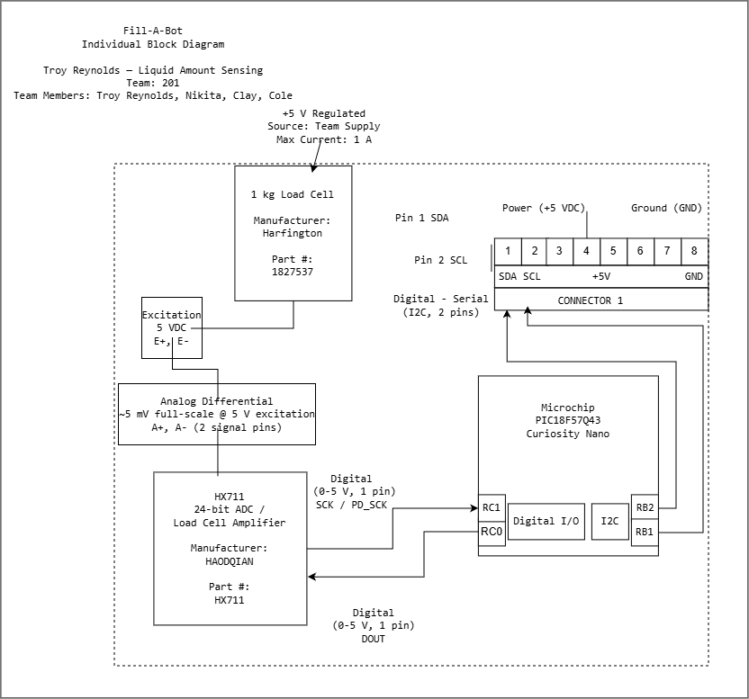

## Overview

The individual block diagram documents the electrical design of the Liquid Amount Sensing subsystem for Fill-A-Bot. The subsystem measures the amount of liquid using a 1 kg load cell connected to an HX711 24-bit ADC and load cell amplifier. A PIC18F57Q43 Curiosity Nano reads the HX711 and communicates with the Fill-A-Bot main controller using I2C.

The subsystem receives regulated +5 V power from the team power supply through the 8-pin ribbon cable. The ribbon cable also provides the SDA and SCL connections used for communication with the main controller and a common ground connection.

## Individual Block Diagram

**Figure 1:** Individual block diagram for the Fill-A-Bot Liquid Amount Sensing subsystem.

## Power

The subsystem operates from a regulated +5 V supply provided by the Fill-A-Bot main controller. The 5 V regulator is rated for up to 1 A. Power is provided through Pin 4 of the 8-pin ribbon cable, while Pin 8 provides the common ground connection.

## Liquid Amount Sensing

A 1 kg Harfington load cell is used to measure the weight of the liquid. The load cell uses a 5 V excitation and produces a differential analog output of approximately 5 mV at full-scale load. The A+ and A- differential outputs are connected to the HX711.

The HX711 is a 24-bit ADC and load cell amplifier used to convert the small differential signal from the load cell into digital measurement data. The PIC18F57Q43 communicates with the HX711 using two digital signals. RC1 provides the SCK/PD_SCK clock signal, and RC0 receives the DOUT signal from the HX711.

## Team Communication

The Liquid Amount Sensing subsystem communicates with the Fill-A-Bot main controller using I2C. RB2 is used for SDA and RB1 is used for SCL.

The 8-pin ribbon cable connections used by this subsystem are:

| Pin | Function |
| --- | --- |
| 1 | SDA |
| 2 | SCL |
| 3 | Unused |
| 4 | +5 V |
| 5 | Unused |
| 6 | Unused |
| 7 | Unused |
| 8 | GND |
